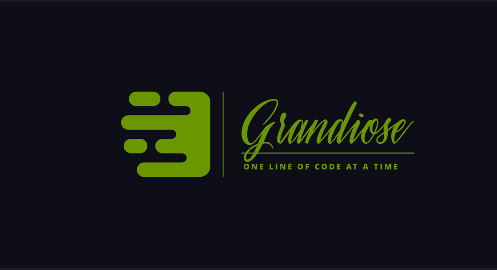

<a name="readme-top"></a>

<div align="center">

  <br/>

  <h3><b>School Library</b></h3>

</div>
# 📗 Table of Contents

- [📗 Table of Contents](#-table-of-contents)
- [📖 School Library ](#-school-library-)
  - [🛠 Built With ](#-built-with-)
    - [Tech Stack ](#tech-stack-)
    - [Key Features ](#key-features-)
  - [Getting Started](#getting-started)
    - [Prerequisites](#prerequisites)
    - [Setup](#setup)
    - [Useage](#useage)
    - [Run tests](#run-tests)
    - [Deployment](#deployment)
  - [👥 Authors ](#-authors-)
  - [🔭 Future Features ](#-future-features-)
  - [🤝 Contributing ](#-contributing-)
  - [⭐️ Show your support ](#️-show-your-support-)
  - [🙏 Acknowledgments ](#-acknowledgments-)
  - [📝 License ](#-license-)


# 📖 School Library <a name="about-project"></a>

School Library 

**School Library** is a tool that helps the librarian to keep track of the books and the people who borrow them.

## 🛠 Built With <a name="built-with"></a>

### Tech Stack <a name="tech-stack"></a>
  <details>
    <ul>
      <li><a href="https://www.ruby-lang.org/en/">Ruby</a></li>
    </ul>
  </details>

<p align="right">(<a href="#readme-top">back to top</a>)</p>

### Key Features <a name="key-features"></a>

- **Manage Books**
- **Record the data of the person who borrows the books**

## Getting Started

### Prerequisites
In order to run this project, you must have installed and configured ruby in your local environment:


### Setup

Clone this repository to your desired folder:

<!--
Example commands:

```sh
  cd my-folder
  git@github.com:MasumaJaffery/Enumerable.git
```
 
--->
Before to run the program, verify that you have Ruby installed on your OS running the following command:
<!--
```sh
   ruby -v
```
--->

### Useage

Run the following command inside the project folder:
1. Open your terminal and navigate to the root directory of your project.
2. Run `IRB`
3. require the files you want to use. Ex: `require "./app.rb"`
4. Now you are ready

<p align="right">(<a href="#readme-top">back to top</a>)</p>

### Run tests

You can run this tests

```$
  rubocop
```

### Deployment

You can deploy this project using: GitHub Pages Netifly or Render 

<p align="right">(<a href="#readme-top">back to top</a>)</p>

## 👥 Authors <a name="authors"></a>

👤 **Joseph L Kausi**

- GitHub: [@Grandi0z](https://github.com/Grandi0z)
- Twitter: [@Joseph_LSK](https://twitter.com/Joseph_LSK)
- LinkedIn: [Joseph L Kausi](https://www.linkedin.com/in/joskal/)


<p align="right">(<a href="#readme-top">back to top</a>)</p>

## 🔭 Future Features <a name="future-features"></a>


- [ ] **Store data in a database**
- [ ] **Add a UI**

<!-- CONTRIBUTING -->

## 🤝 Contributing <a name="contributing"></a>

Contributions, issues, and feature requests are welcome!

Feel free to check the [issues page](https://github.com/Grandi0z/school_library/issues).

<p align="right">(<a href="#readme-top">back to top</a>)</p>

<!-- SUPPORT -->

## ⭐️ Show your support <a name="support"></a>

If you like this project, I would like to Thank You!

<p align="right">(<a href="#readme-top">back to top</a>)</p>

<!-- ACKNOWLEDGEMENTS -->

## 🙏 Acknowledgments <a name="acknowledgements"></a>

Special Thanks to the Microverse and Micronauts.


<p align="right">(<a href="#readme-top">back to top</a>)</p>

<!-- LICENSE -->

## 📝 License <a name="license"></a>

This project is [MIT](https://github.com/Grandi0z/school_library/blob/build/LICENSE) licensed.

<p align="right">(<a href="#readme-top">back to top</a>)</p>
